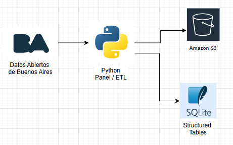
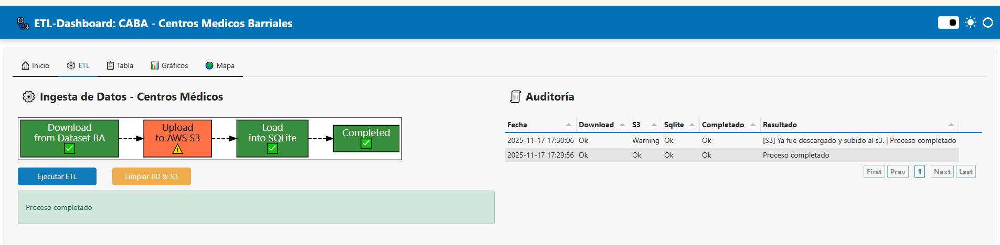
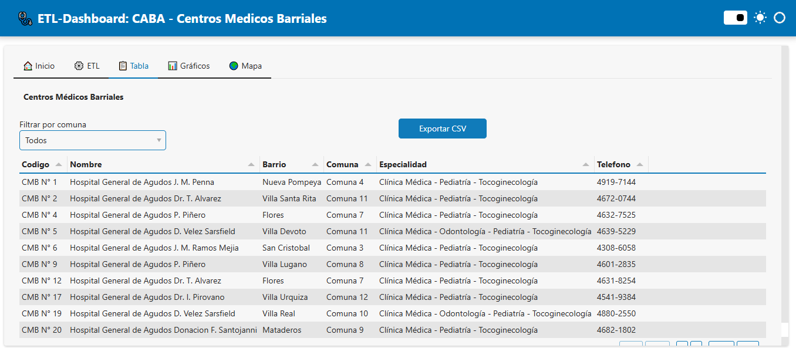
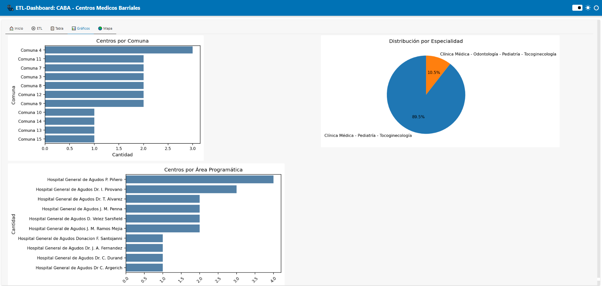
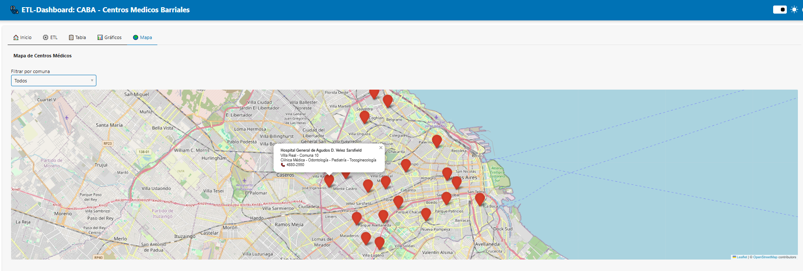

# 🏥 Proyecto de Ingesta de datos BA para el sector de la salud
Este proyecto demuestra un flujo de trabajo completo de ingeniería de datos 
para registros de salud sintéticos utilizando datos CABA generados por 
Datos Abiertos de CABA. 

⚙️ La ingesta de datos es simple.  
🧩 El desafío real: construir un dashboard interactivo que combine ETL, auditoría, gráficos y mapas.  
🌍 Todo sobre un entorno reproducible con **LocalStack**, simulando AWS localmente para buckets S3 y servicios auxiliares.


## 🚀 Características del proyecto
Este dashboard ejecuta un pipeline ETL completo sobre datos abiertos de centros médicos 
de la Ciudad Autónoma de Buenos Aires (CABA), integrando geolocalización, almacenamiento local y visualización interactiva. 
<br>
El pipeline ya está operativo y modularizado.<br>
Los datos se descargan, transforman y almacenan de forma reproducible.<br> 
Las vistas de Datos y Mapa permiten explorar los resultados de forma interactiva.



### 🔄 Etapas del Pipeline:

#### Ingesta full de conjuntos de datos sobre los centros medicos de Buenos Aires

- Descarga automática de un archivo GeoJSON desde el portal de datos abiertos de CABA
- Almacenamiento local del archivo en un bucket S3 simulado (local)
- Transformación y mapeo de los datos geográficos y atributos médicos
- Persistencia en una base de datos SQLite, incluyendo coordenadas y metadatos
- Visualización en dos páginas del dashboard:
  - 📊 Datos: tabla interactiva y gráficos
  - 🌍 Mapa: puntos geolocalizados sobre Leaflet

### 🧱 Tecnologías utilizadas

- Python 3.13
- Dataset BA
- S3 (Localstack como AWS Local)
- SQLite (Persistencia como BigQuery)
- Libraries Python
  - Panel (Visualizacion)
  - Panda
  - Folium - Leaflet (SIG - GeoLocation)
  - Graphviz (Workflow)
  - matplotlib y seaborn


## 🧪 Test: Docker Local o Pycharm

### 🛠 Instrucciones de configuración
<br>

#### 🚀 Local

1) Contar con la imagen Localstack en el docker

2) Activar venv e instalar dependencias
```
python -m venv venv
venv/bin/activate"

pip install --upgrade pip
pip install -r requirements.txt
```

3) Levantar la aplicacion 
```
panel serve app/dashboards/run.py --show
```

4) Una vez levantado...

Tu app estará disponible en http://localhost:5006 y LocalStack en http://localhost:4566

---

#### 🐳 Docker

1) Compilar y crear contenedor en Docker (incluye la imagen localstack)
```
docker-compose up -d --build
```

2) Una vez levantado el contendor... 

Tu app estará disponible en http://localhost:5006 y LocalStack en http://localhost:4566

<br>

#### Tips sobre localstack como AWS Local
```
awslocal s3 ls
awslocal s3 ls s3://centros-medicos-barriales
awslocal s3 ls s3://centros-medicos-barriales/datasets/
awslocal s3 ls s3://centros-medicos-barriales/ --recursive
```

---

## 📘 Demos (Capturas)

### 1. **Panel de control ETL**
- Workflow ETL
- Boton Ejecutar ETL
- Boton Limpiar BD & S3
- Auditoria



### 2. **Tabla Tabulator con filtros**
- Listado de centros con columnas: nombre, barrio, comuna, especialidades, teléfono
- Filtros por comuna
- Opción de exportar a CSV



### 3. **Gráficos de distribución**
- **Barras horizontales**: Cantidad de centros por comuna
- **Torta**: Distribución por especialidad
- **Histograma**: Cantidad de centros por área programática



### 4. **Mapa interactivo con Leaflet**
- **Marcadores por centro médico**, con `popup` mostrando nombre, especialidades, dirección, teléfono
- **Filtro por comuna** que actualice el mapa dinámicamente



---

## 👩‍💻 Author

**Leandro Garayoa**  
Ing. Informatica - Senior Software Engineer con enfoque técnico en Arquitectura de Software, ETLs y Soluciones de Datos, con experiencia en Big Data, analítica y visualización técnica.<br>
AWS | Java | Python | ETL | IA (LLM-RAG-Agente IA) | Big Data | Data Analyst / Scientist | React | JQuery | Javascript<br>

- 💼 [LinkedIn](https://www.linkedin.com/in/leandro-garayoa-9ba12060/) 
- 🌐 [Web Portfolio](https://vasquito.github.io/LGisITTechie/)
- 🐙 [GitHub Portfolio](https://github.com/vasquito)

